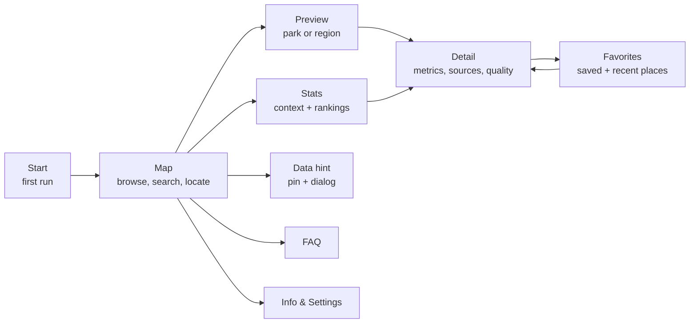

# WindKlar

WindKlar is a Kotlin Multiplatform app for Android and iOS that helps people in Germany understand local onshore wind energy. It turns public, source-backed wind park data into a calm map-first experience with local context, impact metrics, favorites, FAQ content and data-quality hints.

The project is built for a university seminar with the Umweltbundesamt as seminar customer. The README is intentionally short; durable product, domain and implementation rules live in the documents linked below.

## Source Of Truth
- [Product PRD](docs/product/WindKlar_PRD.md): scope, roadmap, acceptance criteria and manual QA expectations.
- [Domain Context](CONTEXT.md): glossary and preferred product language.
- [Architecture Decisions](docs/adr): accepted technical and product decisions.
- [Agent Instructions](AGENTS.md): implementation rules for coding agents.

## Core Features
- Map-first discovery of onshore wind parks and regional wind energy context.
- Integrated map search for wind parks, municipalities, districts and states.
- Wind park and region detail views with metrics, source context and data-quality labels.
- Favorites and recently viewed wind parks stored locally without an account.
- Statistics view for national context, rankings, comparisons and impact drilldowns.
- FAQ and info/settings areas for explanations, assumptions and app transparency.
- Local data hints for reporting missing, incorrect or outdated wind installation data.

## App Flow
WindKlar is map-first. Users start on the map, discover a wind park or region, then decide whether they want details, saved places, statistics, help content or a local data hint.



The detailed route model is implemented in `composeApp/src/commonMain/kotlin/app/navigation`.

## Repository Map
- `composeApp`: shared Kotlin and Compose Multiplatform app code.
- `androidApp`: Android launcher and platform packaging.
- `iosApp`: native iOS launcher.
- `data`: preprocessing pipeline and generated app-ready source data.
- `docs/product`: product requirements and acceptance criteria.
- `docs/adr`: architecture decision records.
- `scripts`: local helper scripts, including screenshot capture.

Shared UI, state and repository contracts should live in `composeApp/src/commonMain`. Platform folders should stay limited to platform-specific integrations.

## Runtime Data
WindKlar runs local-first. The app opens a bundled, preprocessed source SQLite database and a separate persistent user database. Public source data can be replaced with a newer bundled snapshot without replacing local user state such as favorites, recents and data hints.

Runtime code should follow the boundary documented in [AGENTS.md](AGENTS.md):

```text
UI -> ViewModel/UseCase -> Repository -> Local DB/DAO
```

## Build
Android:

```powershell
.\gradlew.bat :androidApp:assembleDebug
```

Unix-like shells:

```shell
./gradlew :androidApp:assembleDebug
```

iOS: open `iosApp` in Xcode and run from there.

For docs-only changes:

```powershell
git diff --check
```

## Screenshots
The Android screenshot helper can build, install, launch and capture the MVP screens via `adb`:

```powershell
.\scripts\capture_android_screenshots.ps1 -Build -Install -CleanAppData
```

For stitched long screenshots:

```powershell
.\scripts\capture_android_screenshots.ps1 -Build -Install -CleanAppData -FullPage -InitialWaitSeconds 25
```

Screenshots are written to ignored analysis folders under `screenshots/android-ai/<timestamp>/`.
