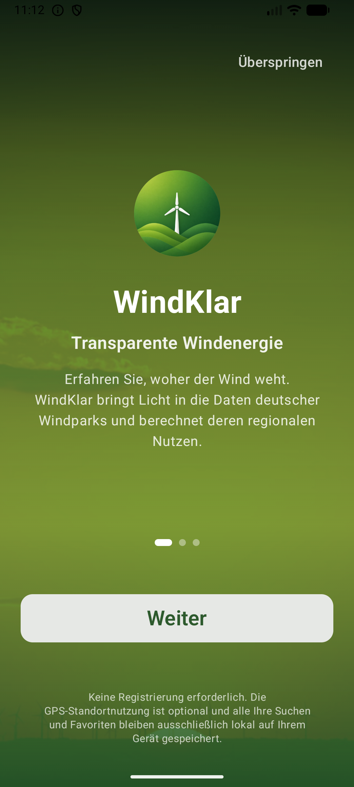
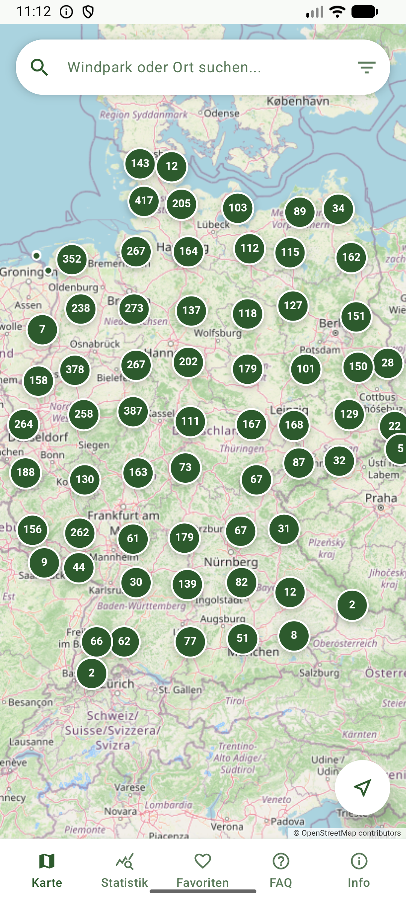
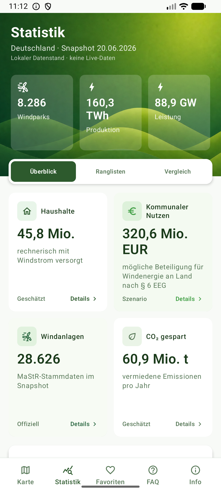
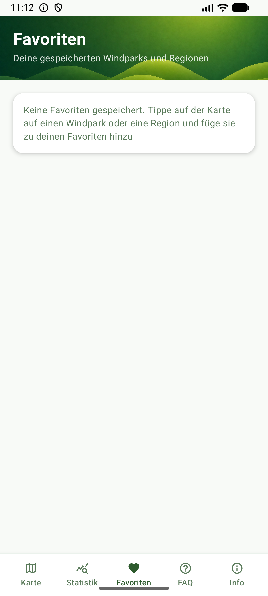
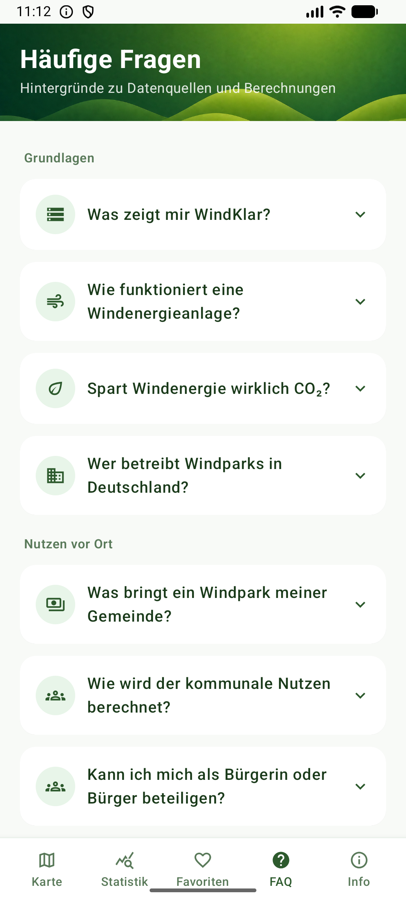
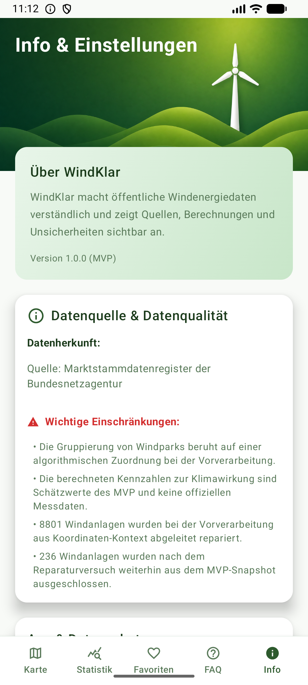
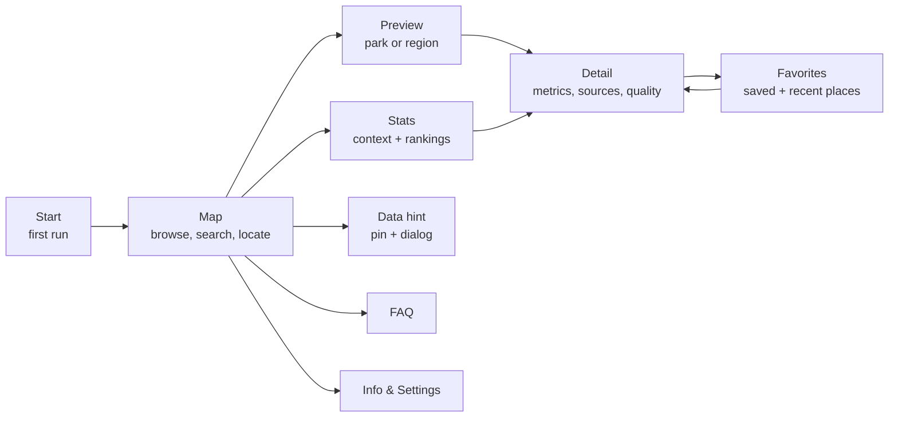

<p align="center">
  
</p>

<h1 align="center">WindKlar</h1>

<p align="center">
  <strong>Calm, factual, and transparent onshore wind energy insights for Germany.</strong>
</p>

<p align="center">
  <a href="https://kotlinlang.org/docs/multiplatform.html"></a>
  <a href="https://developer.android.com/"></a>
  <a href="https://www.apple.com/ios/"></a>
  <a href="https://sqlite.org/"></a>
  <a href="https://www.umweltbundesamt.de/"></a>
</p>

---

**WindKlar** is a Kotlin Multiplatform app for Android and iOS that helps citizens in Germany understand nearby onshore wind parks, energy production context, municipal benefits, data quality, and local data anomalies. It turns public, Marktstammdatenregister (MaStR)-backed source data into a clear, map-first mobile experience with strict factual accuracy.

The app is built as a seminar MVP for a university course in cooperation with the **Umweltbundesamt (UBA)**.

---

## 📱 App Walkthrough & Screens

Here is a look at the current user experience:

| **Start & Welcome** | **Interactive Map** | **Insights & Stats** |
|:---:|:---:|:---:|
|  |  |  |
| Clear introduction and prompt to launch. | Map navigation with wind park pins, search overlays, and details. | Nationwide context, rankings, and impact calculations. |

| **Saved Favorites** | **FAQ & Education** | **Settings & Info** |
|:---:|:---:|:---:|
|  |  |  |
| Local favorites list and recently visited wind parks. | Educational questions & answers about wind energy. | App information, data assumptions, and settings. |

---

## ✨ Core Features

- 🗺️ **Map-First Discovery**: Browse onshore wind parks and regional wind energy metrics on an interactive map.
- 🔍 **Integrated Search Overlay**: Search for wind parks, municipalities, districts, or federal states directly on the map screen.
- 📊 **Detailed Metrics & Sources**: Deep-dive views for wind parks and regions displaying performance values, source information, calculation details, and data-quality labels.
- 🏷️ **Data Quality Transparency**: First-class labels indicating whether metrics are `official`, `measured`, `derived`, `estimated`, `simulated`, or `missing`.
- 💛 **Favorites & Recents**: Bookmark parks/regions or browse recently opened locations. Everything is stored locally without account requirements.
- 📈 **National Stats & Rankings**: Dynamic charts and rankings comparing municipalities and states.
- 💡 **Local Data Hints**: Report data errors or missing installations via placement pins on the map (local "Datenhinweise").
- 📄 **Educational FAQ**: Quick access to factual information on wind energy, land usage, noise, and assumptions.

---

## 🔄 App Flow

WindKlar is map-first. Users start on the map, discover a wind park or region, then decide whether they want details, saved places, statistics, help content, or a local data hint.



The detailed route model is implemented in `composeApp/src/commonMain/kotlin/app/navigation`.

---

## 📂 Documentation & Source of Truth

We keep detailed project details separated for clarity:
- 📖 **[Product PRD](docs/product/WindKlar_PRD.md)**: Product scope, roadmap, acceptance criteria, and manual QA expectations.
- 🗂️ **[Domain Context](CONTEXT.md)**: Project glossary and domain language definitions.
- 📐 **[Architecture Decisions (ADRs)](docs/adr)**: Accepted technical and design choices.
- 🤖 **[Agent Instructions (AGENTS.md)](AGENTS.md)**: Coding rules and development boundaries.

---

## 🏗️ Architecture & Stack

WindKlar is structured as a Kotlin Multiplatform (KMP) project targeting Android and iOS, sharing almost all UI code via **Compose Multiplatform**.

```text
UI (Compose Multiplatform) ──> ViewModel/UseCase ──> Repository ──> Local DB (SQLDelight) ──> SQLite
```

- **`composeApp`**: The shared KMP codebase where all features, models, views, and repositories live.
  - `src/commonMain/kotlin/app/navigation`: App navigation routing model (`AppNavHost`).
  - `src/commonMain/kotlin/app/feature/*`: Modular packages per feature containing screens, view models, and state models (`FeatureScreen`, `FeatureViewModel`, `FeatureUiState`).
  - `src/commonMain/kotlin/app/core`: UI styling, design tokens, icons, and theme values.
  - `src/commonMain/kotlin/app/data`: Local repositories, DAO contracts, and SQLDelight setups.
- **`androidApp`**: Android-specific packaging and entry point.
- **`iosApp`**: Xcode project/launcher for native iOS deployment.
- **`data`**: Preprocessing scripts and SQLite source seeding pipelines.

---

## 💾 Runtime Data Setup

WindKlar runs fully local-first with zero runtime API dependencies:
1. **Source Seed Database (`windklar_source_seed.db`)**: Preprocessed, Germany-wide database containing MaStR wind turbine coordinates, wind parks, and pre-calculated region metrics.
2. **User Database (`windklar_user.db`)**: Persistent SQLite database storing favorites, recently opened items, and submitted local data hints.

The app automatically copies the latest bundled source seed database when a checksum update is detected, leaving the user's local database untouched.

---

## 🛠️ Build & Development Guides

### Build Android App
To build the debug APK on Windows:
```powershell
.\gradlew.bat :androidApp:assembleDebug
```
Or on Unix-like shells:
```bash
./gradlew :androidApp:assembleDebug
```

### Build iOS App
Open the `iosApp` folder in Xcode on macOS, configure signing, and run on a Simulator or connected physical device.

### Check Documentation Rules
For docs-only validation:
```powershell
git diff --check
```

### Capture Screenshots
An automated Android QA script can build, launch, and capture screenshots for all screens via `adb`:
```powershell
.\scripts\capture_android_screenshots.ps1 -Build -Install -CleanAppData
```
For stitched full-page screenshots:
```powershell
.\scripts\capture_android_screenshots.ps1 -Build -Install -CleanAppData -FullPage -InitialWaitSeconds 25
```
Screenshots are output to `screenshots/android-ai/<timestamp>/`.

